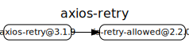

# 源码分析

## 文件结构

``` bash
/Users/liufang/openSource/FunnyLiu/axios-retry
├── CHANGELOG.md
├── LICENSE
├── README.md
├── es
|  └── index.js
├── index.d.ts
├── index.js
├── package-lock.json
├── package.json
├── spec
|  ├── index.spec.js
|  └── support
|     └── jasmine.json
└── yarn.lock

directory: 3 file: 11

ignored

```

## 外部模块依赖



## 内部模块依赖


  